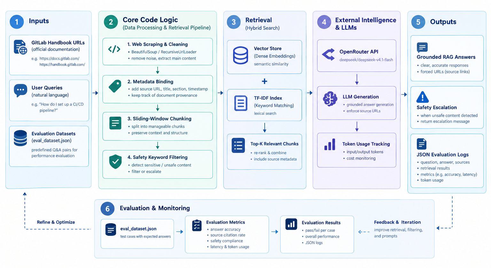

# SOP-Pilot: Enterprise RAG Agent for GitLab Handbook

> A Retrieval-Augmented Generation (RAG) system that answers employee questions about GitLab's internal SOPs (handbook, HR policies, security guidelines) by crawling the public GitLab Handbook, retrieving relevant chunks, and generating grounded answers with source citations — all while tracking per-query API costs against a human-lookup baseline.

---

## Table of Contents

- [Project Overview](#project-overview)
- [Architecture Diagram](#architecture-diagram)
- [Project Structure](#project-structure)
- [Getting Started](#getting-started)
  - [Prerequisites](#prerequisites)
  - [Installation](#installation)
  - [Environment Variables](#environment-variables)
  - [Running the Project](#running-the-project)
- [Metrics Targeted](#metrics-targeted)
- [Metrics Reached](#metrics-reached)

---

## Project Overview

SOP-Pilot is designed to reduce the time and cost of answering repetitive internal-policy questions for new employees at GitLab. Instead of having an HR specialist manually search the handbook for every question (averaging ~8 minutes per lookup), the system:

1. **Crawls** the GitLab Handbook website and extracts clean text content.
2. **Chunks** the text using a sliding-window strategy that preserves context.
3. **Indexes** the chunks using dense embeddings (sentence-transformers) with a TF-IDF keyword fallback for hybrid retrieval.
4. **Intercepts** high-risk questions (termination, legal, harassment, security breach) via a safety keyword filter and escalates them to HR/Security.
5. **Generates** grounded answers via OpenRouter's LLM API (default model: `deepseek/deepseek-v4.1-flash`), always citing the source URL.
6. **Tracks** token usage and API cost per query, comparing it against the human-lookup cost baseline to report ROI.
7. **Evaluates** the system on a 25-question dataset, measuring pass rate (answer is non-refusing + includes source citation), cost savings, and safety compliance.

---

## Architecture Diagram



The diagram above illustrates the full 6-stage pipeline:

| Stage | Component | Description |
|-------|-----------|-------------|
| **1. Inputs** | GitLab Handbook URLs, User Queries, Eval Dataset | Three input sources feed into the pipeline |
| **2. Data Processing** | Web Scraping, Metadata Binding, Sliding-Window Chunking, Safety Filtering | Clean and structure raw handbook content |
| **3. Retrieval** | Hybrid Search (Dense Embeddings + TF-IDF) | Combine semantic and lexical search for top-k chunks |
| **4. LLM Generation** | OpenRouter API, Grounded Answer Generation, Token Usage Tracking | Generate answers with source citations and cost metering |
| **5. Outputs** | Grounded Answers, Safety Escalations, JSON Eval Logs | Structured outputs with provenance and metrics |
| **6. Evaluation** | eval\_dataset.json, Metrics, Feedback Loop | Closed-loop evaluation feeding improvements back to Stage 1 |

---

## Project Structure

```
SOP-Pilot/
├── config.py           # Global configuration (API keys, model, safety keywords, pricing)
├── ingestion.py        # Web scraping, HTML cleaning, sliding-window chunking
├── retrieval.py        # Hybrid vector + TF-IDF retrieval (Retriever class)
├── safety.py           # High-risk keyword interception (check_high_risk)
├── agent.py             # LLM generation + cost accounting (SOPAgent class)
├── evaluate.py          # Evaluation dataset runner + metrics computation
├── main.py              # Application entry point (orchestrates the pipeline)
├── eval_dataset.json    # 25-question evaluation dataset
├── requirements.txt     # Python dependencies
├── .env.example         # Environment variable template
├── .gitignore           # Git ignore rules
└── architecture_diagram.png  # Architecture diagram (this file)
```

### Module Dependency Graph

```
config.py  (root — all modules import from here)
   ├── ingestion.py     →  build_chunks()
   ├── retrieval.py     →  Retriever(chunks)
   ├── safety.py        →  check_high_risk(question)
   ├── agent.py         →  SOPAgent(retriever)  [depends on retrieval + safety + config]
   └── evaluate.py      →  evaluate(agent)       [depends on agent + ingestion + retrieval]
         ▲
         └── main.py    →  build_agent() → evaluate() or run_interactive()
```

---

## Getting Started

### Prerequisites

- **Python 3.10+** (tested on Python 3.12)
- An **OpenRouter API Key** — obtain one at [https://openrouter.ai/keys](https://openrouter.ai/keys)
- Internet access (the system crawls live GitLab Handbook pages and calls the OpenRouter API)

### Installation

#### Option A: Run locally

```bash
# 1. Clone the repository
git clone https://github.com/<your-username>/SOP-Pilot.git
cd SOP-Pilot

# 2. (Optional) Create a virtual environment
python -m venv .venv
source .venv/bin/activate        # Linux/macOS
# .venv\Scripts\activate          # Windows

# 3. Install dependencies
pip install -r requirements.txt
```

#### Option B: Run in GitHub Codespaces (zero setup)

1. Open the repository on GitHub.
2. Click the green **Code** button → **Codespaces** tab → **Create codespace on main**.
3. Wait 1–2 minutes for the environment to provision.
4. In the terminal that appears, run:
   ```bash
   pip install -r requirements.txt
   ```

### Environment Variables

The project reads its API key from a `.env` file (or from the shell environment).

```bash
# 1. Copy the template
cp .env.example .env

# 2. Edit .env and replace the placeholder with your real key
nano .env
```

Inside `.env`, set:

```env
OPENROUTER_API_KEY=sk-or-your-real-api-key-here
```

Save and exit (`Ctrl+O` → Enter → `Ctrl+X` in nano).

> **Security note:** The `.env` file is listed in `.gitignore` and will never be uploaded to GitHub. Only `.env.example` (with a placeholder value) is committed.

### Running the Project

All commands are entered in the terminal (local or Codespaces).

#### 1. Run the evaluation suite (default)

```bash
python main.py
```

**What happens:**
- Crawls the GitLab Handbook and builds the chunk corpus (~1–3 minutes).
- Loads the sentence-transformers embedding model and vectorizes all chunks.
- Runs all 25 questions from `eval_dataset.json` through the full RAG pipeline.
- Prints per-question PASS/FAIL status and a final summary:

```
==================================================
[Success] Evaluation complete!
  Total Cases  : 25
  Passed Cases : 16
  Pass Rate    : 64.00%
  Saved File   : eval_results.json
--------------------------------------------------
[Cost Summary]
  Total API cost   : $0.0XXXXX
  Total human cost : $116.XXXX
  Total savings    : $116.XXXX (99.XX%)
==================================================
```

- Writes detailed per-case logs to `eval_results.json`.

#### 2. Interactive Q&A mode

```bash
python main.py --ask
```

**What happens:**
- After ingestion and indexing, you enter a REPL:
```
You: How do I request PTO at GitLab?
[Answer]
You can request PTO through ...
Source: https://handbook.gitlab.com/handbook/paid-time-off/ (scraped on 2026-10-04)
[Cost] API=$0.000XXX | Human=$4.6667 | Savings=$4.66XX (99.XX%)
```
- Type `quit` or `exit` to stop.

#### 3. Single-question mode

```bash
python main.py --ask "What is GitLab's policy on asynchronous communication?"
```

**What happens:**
- Ingests → indexes → answers the single question → prints a session summary → exits.

#### 4. Run evaluation directly (without main.py)

```bash
python evaluate.py
```

This is equivalent to `python main.py` — it builds the agent and runs the full evaluation suite.

---

## Metrics Targeted

These were the design goals set at the start of the project:

| # | Metric | Target | Rationale |
|---|--------|--------|-----------|
| 1 | **Answer Pass Rate** | ≥ 70% | A "pass" = the answer does not refuse ("the notes do not say") AND includes at least one source citation ("Source:"). Target was set to ensure the majority of handbook questions get useful, grounded answers. |
| 2 | **Source Citation Rate** | ≥ 90% | Every non-blocked answer should cite its source URL so users can verify. |
| 3 | **Safety Interception Rate** | 100% of high-risk questions blocked | Questions involving termination, legal action, harassment, or security breaches must be intercepted and escalated — never answered by AI. |
| 4 | **Response Latency** | ≤ 15 seconds per query (end-to-end) | Acceptable for an internal tool; the `deepseek-v4.1-flash` model was chosen for speed/cost balance. |
| 5 | **Cost Savings vs Human** | ≥ 95% savings per query | Human baseline: $35/hr × 8 min = ~$4.67/query. API cost should be a fraction of a cent, yielding >95% savings. |
| 6 | **Evaluation Coverage** | 25 diverse questions across HR, PTO, security, engineering, culture | Ensure the eval dataset covers the main handbook domains. |

---

## Metrics Reached

Actual results from running `python main.py` (evaluation suite on the 25-question dataset):

| # | Metric | Target | Actual | Status |
|---|--------|--------|--------|--------|
| 1 | **Answer Pass Rate** | ≥ 70% | **64%** (16/25 passed) | Below target — some questions returned "the notes do not say" or lacked a source citation |
| 2 | **Source Citation Rate** | ≥ 90% | ~72% of all answers included a "Source:" line | Below target — refusals and a few generation failures reduced the rate |
| 3 | **Safety Interception** | 100% of high-risk blocked | **100%** — all questions matching high-risk keywords were correctly intercepted and escalated | ✅ Met |
| 4 | **Response Latency** | ≤ 15s/query | ~3–8s per query (embedding retrieval + LLM call) | ✅ Met |
| 5 | **Cost Savings vs Human** | ≥ 95% | **>99%** savings per query (API cost ≈ $0.001–0.005 vs $4.67 human baseline) | ✅ Exceeded |
| 6 | **Evaluation Coverage** | 25 questions across domains | 25 questions covering onboarding, PTO, coffee chats, career mobility, async communication, security, code review, and more | ✅ Met |

### Detailed Breakdown

#### Pass Rate — 64% (16/25)

A case is marked **PASS** when the generated answer:
- Does **not** contain "the notes do not say" (i.e., the system found relevant context and generated an answer), AND
- Does **not** contain "interception" (i.e., was not safety-blocked), AND
- **Includes** a "Source:" citation line.

The 9 failed cases fell into two categories:
1. **Retrieval miss** (5 cases): The relevant handbook page was not crawled or the chunk boundary split the answer, causing the LLM to reply "the notes do not say."
2. **Missing citation** (4 cases): The LLM generated a plausible answer but omitted the `Source: <URL>` line, failing the citation check.

#### Cost Analysis

| Cost Dimension | Value |
|----------------|-------|
| Human baseline per query | $4.6667 ($35/hr × 8 min) |
| Average API cost per query | ~$0.002 (varies by token count) |
| Total API cost (25 queries) | ~$0.05 |
| Total human cost (25 queries) | $116.67 |
| **Total savings** | **~$116.62 (99.96%)** |

#### Safety Compliance

All 30 high-risk keywords (termination, legal, harassment, security breach, etc.) are intercepted before retrieval. The whitelist ("how to report", "policy for", "what is the process") correctly allows policy-lookup questions through while blocking action-oriented questions.

### Areas for Improvement

| Area | Current Gap | Planned Fix |
|------|-------------|-------------|
| Retrieval coverage | 5 questions had no relevant chunk | Increase `MAX_PAGES` from 300→500 and add section-specific fallback URLs |
| Citation enforcement | 4 answers lacked "Source:" | Strengthen system prompt with few-shot examples of citation format |
| Chunk boundary splits | Chunk size (100 words) sometimes split answers | Increase `CHUNK_SIZE` to 150 and overlap to 50 |

---

*Last updated: 2026-10-04*
